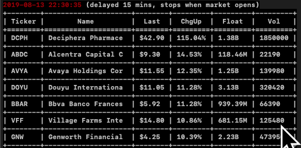

 # topgainers-premarket-scanner



Got sick of manually refreshing my free premarket scanners. This non-API web scraper pulls data from free (delayed) premarket scanner(s) for top gainers, further filtering them with custom parameters such as `Change %`, `Last`, `Volume`, `Float`.

Uses urllib (web request) and BeautifulSoup (HTML parsing).

Uses [thestockmarketwatch.com](http://thestockmarketwatch.com/markets/pre-market/today.aspx) (premarket scanner) and [finance.yahoo.com](https://finance.yahoo.com) (float info).

### Prerequisites (MacOS/Linux)

Python3

### Installing

Clone to your local directory:

```
git clone https://github.com/ohsyln/topgainers-premarket-scanner
cd topgainers-premarket-scanner
```

Activate py virtual environment:

```
source pyvenv/bin/activate
```

## Run script

Edit parameters in `scanner.py` with a text editor:

```
PERIOD = 30 # seconds per refresh
GAINS_PERCENT = 10 # minimum change %
MAX_LAST = 50 # maximum price in dollars
FLOAT_BTW = [0,150000000] # size of public float
MIN_VOLUME = 100000 # minimum volume
```

Save changes and run script

```
python3 scanner.py
```

## License

MIT
